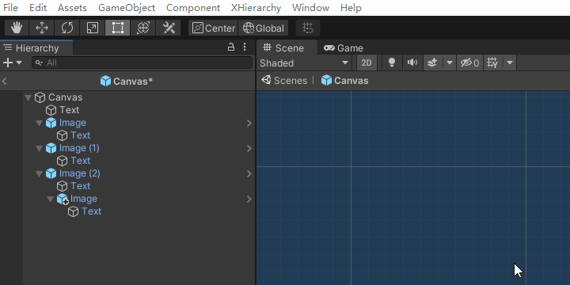
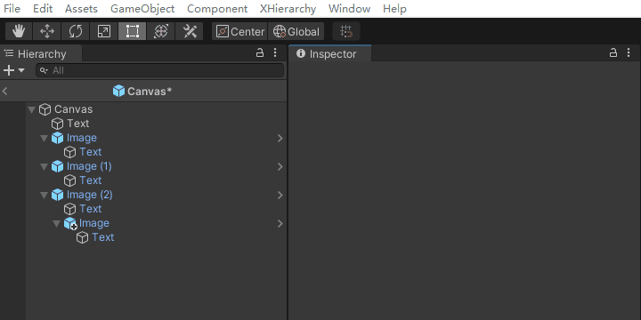
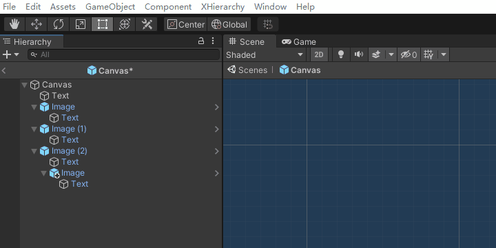
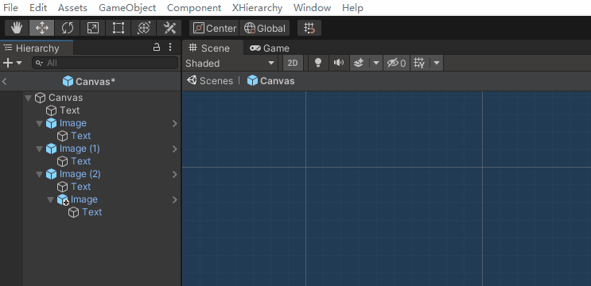
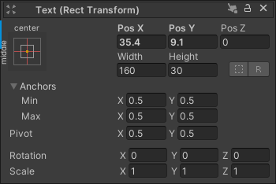
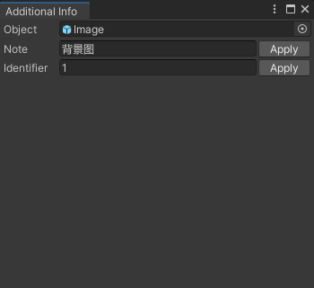
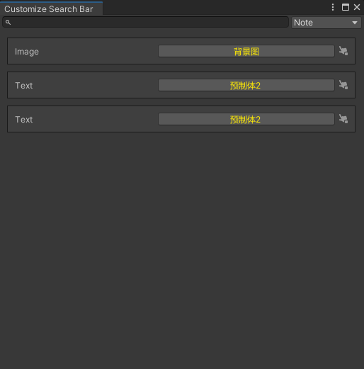
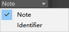
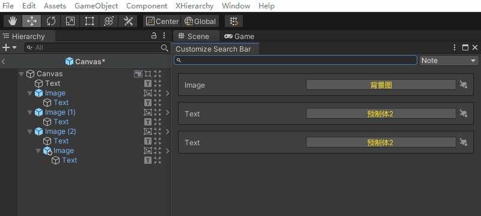

# XHierarchy
- XHierarchy 是一款用于 Unity hierarchy 插件工具，用于增强 Hierarchy 视窗的功能，主要有以下内容：
    - 优化层级显示表现。
    - 增加快捷编辑功能。
    - 增加自定义标签功能。
    - 增加快捷查找功能。

## 初始化配置
- 通过点击 Unity 菜单栏的 "XHierarchy/Create Hierarchy Data Asset" ，可以完成 XHierarchy 的初始化配置。初始化后会在 `Assets/XHierarchy/Editor` 目录下生成所需的配置文件，具体如下：
    - HierarchyData.asset
        - Xierarchy 的数据配置文件，其中 `Default Config` 为默认配置，`Custom Config` 为自定义配置。优先使用自定义配置，如果没有则使用默认配置。
    - ConfigData.asset
        - 默认的配置文件，用于配置 XHierarchy 的默认行为。
    - CustomConfigData.cs
        - 自定义配置的脚本文件，用于配置 XHierarchy 的自定义行为。
### 默认配置
- 默认配置的脚本组件类型包括：
    - `XHierarchy`
    - `UnityEngine.CoreModule`
    - `UnityEngine.UI`
    - `Assembly-CSharp-Editor`
    - `Assembly-CSharp`
- ConfigData.asset 中的选项 `Use Additional Component` ，勾选后，当为 GameObject 添加自定义数据时，则会在 GameObject 上添加组件 `AdditionalDataRecorder` ，用于保存数据。如果没有勾选，则在默认配置下，无法添加自定义数据。

### 自定义配置
- 通过点击 `XHierarchy/Set Custom Config` ，会在 `Assets/XHierarchy/Editor` 目录下生成自定义配置文件 `CustomConfigData.asset`，并将配置设置到 `HierarchyData.asset` 的 `Custom Config` 选项中。
- 通过实现 `CustomConfigData.cs` 的方法内容，可以实现自定义的配置。方法说明如下：
    - `GetItemGUIRange`
        - 通过传入的 GameObject ，返回该 GameObject 在 Hierarchy 中名字后的区域可以用来绘制的范围。
        - 其中，x 表示距离左边界的距离，y 表示距离右边界的距离。为负数时，则表示距离相反边界的距离。如：
            - 当名字后的区域总长为 20 ，`x = 3 ，y = 8` ，表示可用范围为 `[3, 12]` 。
            - 当名字后的区域总长为 20 ，`x = 3 ，y = -8` ，表示可用范围为 `[3, 8]` 。
    - `GetNote`
        - 通过传入的 GameObject ，返回该 GameObject 的注释。
    - `SetNote`
        - 通过传入的 GameObject ，设置该 GameObject 的注释。
    - `GetIdentifier`
        - 通过传入的 GameObject ，返回该 GameObject 的编号。
    - `SetIdentifier`
        - 通过传入的 GameObject ，设置该 GameObject 的编号。
    - `ComponentTypes`
        - 需要显示的脚本组件类型。
- 通过点击 `XHierarchy/Clear Custom Config` ，可以移除自定义配置，改为使用默认配置。

## 功能说明
### 显示层级线
- 菜单栏：
    - `XHierarchy/Show Hierarchy Line`。
- 功能：
    - 显示 Hierarchy 中的层级线。
- 图示：

### 显示脚本图标
- 菜单栏：
    - `XHierarchy/Show Script Icons`。
- 功能：
    - 显示 GameObject 的组件图标，点击可打开[脚本组件窗口](#脚本组件窗口)。
- 图示：

### 显示对象显隐勾选框
- 菜单栏：
    - `XHierarchy/Show Item Active Toggle`。
- 功能：
    - 在 GameObject 的图标前面显示勾选框，用于快速设置 active 和 deactive 状态。
- 图示：
    - 
### 开启对象图标按钮
- 菜单栏：
    - `XHierarchy/Open Item Icon Click`。
- 功能：
    - 点击 GameObject 的图标，可以打开[附加数据窗口](#附加数据窗口)。
- 图示：
    - 
### 显示对象注释
- 菜单栏：
    - `XHierarchy/Show Item Note`。
- 功能：
    - 显示 GameObject 的注释，点击可以打开[附加数据窗口](#附加数据窗口)。
- 图示：
    - 
### 显示对象编号
- 菜单栏：
    - `XHierarchy/Show Item Identifier`。
- 功能：
    - 显示 GameObject 的编号，点击可以打开[附加数据窗口](#附加数据窗口)。
- 图示：
    - 
### 开启附加搜索（Open Additional Search）
- 菜单栏：
    - `XHierarchy/Open Additional Search`。
- 功能：
    - 在 Hierarchy 顶部搜索栏的右侧显示搜索按钮，点击可以打开[搜索窗口](#搜索窗口)。
- 图示：
    - 

## 窗口说明
### 脚本组件窗口

- 脚本组件窗口用于快捷编辑对象上的某个指定组件内容，布局和 Inspector 中组件的内容的基本一致。顶部标题栏的右侧按钮说明如下：
    - 选择按钮 
        - 点击选中 GameObject 对象。
    - 锁定按钮 
        - 点击后将当前窗口锁定，按钮变成上锁状态 ，此时点击其他区域或打开其他组件窗口时，当前窗口不会被关闭，可同时编辑多个对象。
        - 再次点击按钮会将当前窗口解锁，且关闭当前其他所有未锁定的窗口。
        - 拖拽窗口时，当前窗口也会被锁定。
    - 关闭按钮 
        - 点击关闭当前窗口。当窗口被锁定时，需要通过点击关闭按钮才能关闭。
### 附加数据窗口

- 附加数据窗口用于编辑 GameObject 的附加数据，窗口说明如下：
    - `Object`
        - 当前 GameObject 对象。
    - `Note`
        - 当前 GameObject 的注释。
    - `Identifier`
        - 当前 GameObject 的编号。
    - `Apply` 按钮
        - 将当前编辑的数据应用到当前 GameObject。
### 搜索窗口

- 搜索窗口用于搜索附加数据，匹配 Hierarchy 中的 GameObject ，方便快捷定位对象，窗口说明如下：
    - 搜索栏 
        - 
        - 用于输入搜索内容，对 GameObject 进行筛选。未输入内容时，默认显示所有具备附加数据的 GameObject 。
    - 下拉按钮 
        - 
        - 用于选择搜索类型。
    - 选择按钮 
        - 
        - 用于选中当前条目对应的 GameObject 对象。
- 搜索窗口操作流程示例如下：
